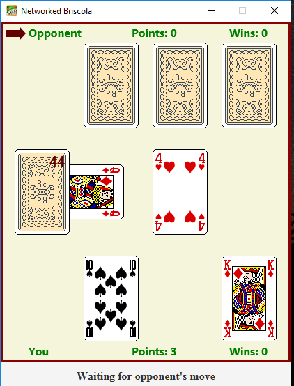

## Pre-requisites

Install JDK 11 or higher and maven.

## Instructions

These application can run on the JVM on desktop platforms. To run the application, execute the following command:

```
mvn javafx:run
```
## A view of the app


## More information

Here are some helpful links:

* [Gluon Client documentation](https://docs.gluonhq.com/client)
* [Gluon Mobile documentation](https://docs.gluonhq.com/mobile)
* [Client Maven Plugin](https://github.com/gluonhq/client-maven-plugin)
* [Client Gradle Plugin](https://github.com/gluonhq/client-gradle-plugin)
